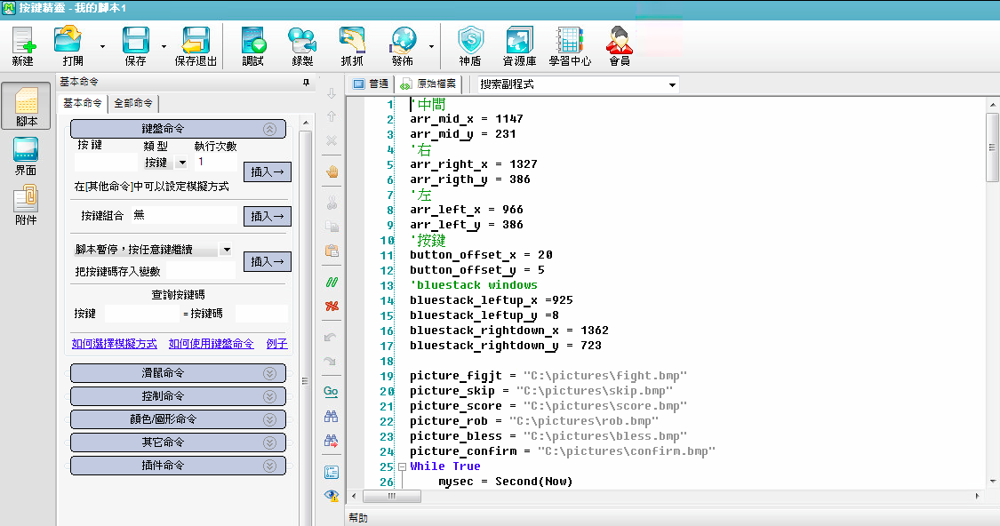
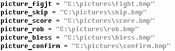
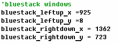
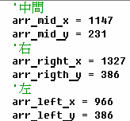
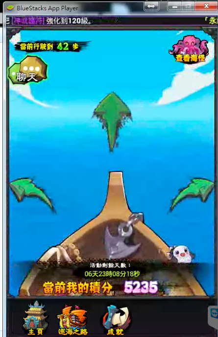

# 航海腳本

##腳本說明
- 免費祈福
- 掠奪者宣戰
- 寇島搶奪
- 海盜對戰

## 使用說明
- 使用按鍵精靈9
- 新建腳本，使用記事本開啟sail_script.Q，將程式碼複製過去  

- 將圖片路徑改為在你電腦上的路徑  

- 用按鍵精靈的抓抓，重新定位bluestack視窗 左上、右下 的xy座標  

-用按鍵精靈的抓抓， 重新定位左中右三個箭頭的xy座標  

- 儲存腳本
- 進入航海畫面  

- 執行腳本

##bugs
- 遇到海怪要自己返回
- 航海結束要手動停止

##可能因螢幕解析度大小或顏色而無法正確點擊按扭而無法執行，請參考下列做法
1. 重新擷圖，自行剪裁出按鈕，用小畫家存成24位元點陣圖
2. 調整button_offset參數
3. 自行修改程式碼
